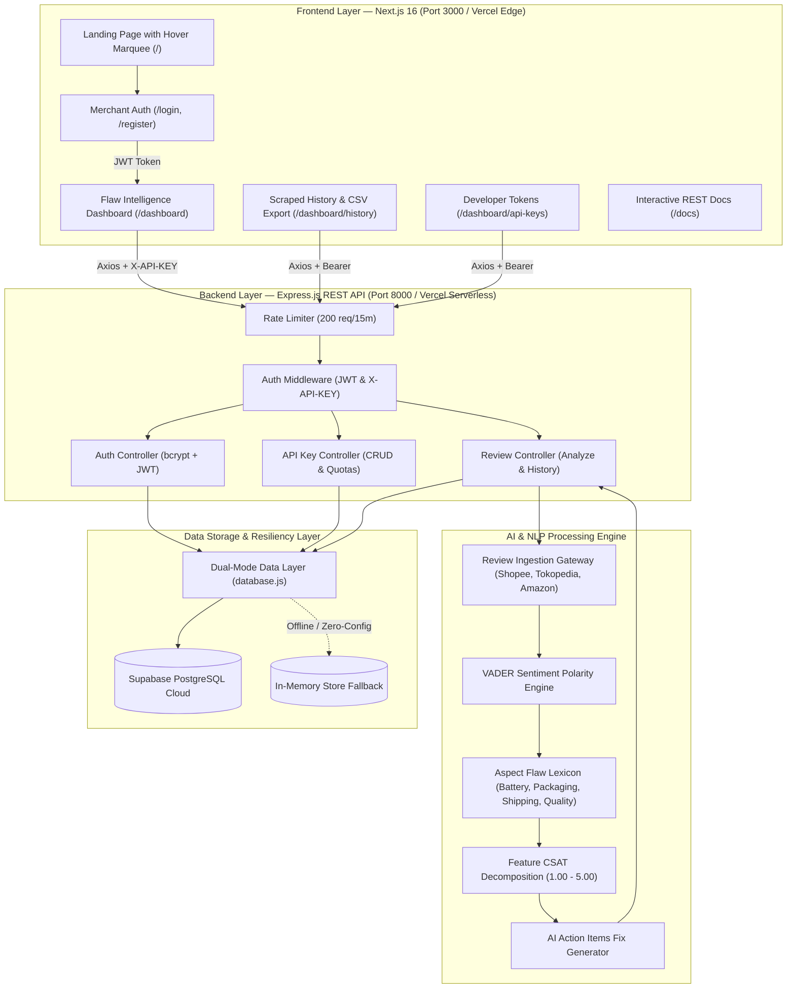

# 📘 Product Requirement Document (PRD): ReviewPulse SaaS

> **Platform**: ReviewPulse SaaS  
> **Kategori**: B2B E-Commerce Customer Review & Flaw Intelligence API  
> **Versi**: v1.0.0 (Production-Ready)  
> **Tech Stack**: Next.js 16, Express.js (Node.js v20+), Supabase PostgreSQL, VADER NLP  
> **Status**: Live & Deployed on Vercel  

---

## 📑 Daftar Isi

1. [Asal-Muasal & Latar Belakang (Genesis & Problem Statement)](#1-asal-muasal--latar-belakang-genesis--problem-statement)
2. [Visi Produk & Nilai Tambah (Value Proposition)](#2-visi-produk--nilai-tambah-value-proposition)
3. [Arsitektur Sistem Lengkap (System Architecture)](#3-arsitektur-sistem-lengkap-system-architecture)
4. [Sistem Database & Penjelasan ORM / Data Layer](#4-sistem-database--penjelasan-orm--data-layer)
5. [Spesifikasi Fitur & Antarmuka (Functional Specifications)](#5-spesifikasi-fitur--antarmuka-functional-specifications)
6. [Pipeline Sumber Data & Scraping Real-Time](#6-pipeline-sumber-data--scraping-real-time)
7. [Model Bisnis, Kuota Token, & Monetisasi SaaS](#7-model-bisnis-kuota-token--monetisasi-saas)
8. [Keamanan, Audit Logging, & Monitoring](#8-keamanan-audit-logging--monitoring)
9. [Panduan Deployment Produksi (Vercel Monorepo)](#9-panduan-deployment-produksi-vercel-monorepo)

---

## 1. Asal-Muasal & Latar Belakang (Genesis & Problem Statement)

### A. Mengapa Memilih Ide Platform Ini?
Di era ledakan e-commerce modern (Shopee, Tokopedia, Lazada, Amazon, TikTok Shop, Blibli), **ulasan pembeli (*customer reviews*) adalah penentu hidup dan matinya sebuah produk**:

1. **Volume Ulasan Terlalu Masif**: Toko e-commerce yang menjual ribuan item menerima puluhan ribu teks ulasan setiap bulannya. Membaca dan merekap ulasan secara manual menggunakan Google Sheets/Excel adalah pekerjaan yang sangat lambat, mahal (butuh banyak admin), dan rentan salah (*human error*).
2. **Kritik Bintang 1–3 Terkubur**: Keluhan pembeli biasanya sangat spesifik dan tersembunyi di dalam teks panjang, contohnya:
   * *"Baterainya panas pas dipakai 1 jam"*
   * *"Kardus penyok dan bubble wrap tipis"*
   * *"Pengiriman kurir telat 3 hari melewati estimasi"*
   * *"Bahan plastik terasa ringkih"*
3. **Dampak Fatal Penurunan Rating**: Di Shopee dan Tokopedia, penurunan rating dari `4.8` ke `4.2` bintang mengakibatkan algoritma pencarian menenggelamkan produk dari halaman utama rekomendasi, yang bisa memangkas **hingga 70% omset penjualan**.
4. **Kesenjangan Otomasi Gudang & R&D**: Belum ada alat (*tool*) ringan berbasis API yang menghubungkan keluhan ulasan pembeli langsung ke sistem ERP Gudang (untuk revisi SOP packing) maupun ke tim R&D (untuk perbaikan fisik produk).

---

## 2. Visi Produk & Nilai Tambah (Value Proposition)

> **"Mengubah ribuan ulasan pembeli e-commerce yang berantakan menjadi intelijen kecacatan produk yang terukur, otomatis, dan dapat langsung ditindaklanjuti (*Actionable Product Intelligence*) melalui Dashboard dan REST API."**

ReviewPulse bertindak sebagai **"Dokter & Alat Diagnostik"** bagi produk e-commerce — mendiagnosis kelemahan produk berdasarkan suara asli konsumen dan memberikan resep perbaikan operasional secara instan.

### Target Pengguna (User Persona):
1. **Seller UMKM & Toko Online**: Memantau kesehatan ulasan harian tanpa perlu merekrut admin rekap.
2. **Tim R&D & Product Manager**: Meriset titik lemah produk **kompetitor** untuk merancang produk tandingan yang lebih unggul.
3. **Brand Principal & Pabrik Manufaktur**: Mengaudit kualitas batch produksi yang didistribusikan oleh ratusan reseller.
4. **Tim Gudang & Logistik ERP**: Mengotomasi tiket perbaikan packing saat komplain kemasan rusak meningkat.

---

## 3. Arsitektur Sistem Lengkap (System Architecture)

ReviewPulse dibangun dengan pola arsitektur **Clean Decoupled Client-Server**:



---

## 4. Sistem Database & Penjelasan ORM / Data Layer

### A. Apakah Ada ORM? Bagaimana Cara Kerjanya?
ReviewPulse mengadopsi **Resilient Data Layer / Custom ORM-Style Adapter (`backend/config/database.js`)**:

1. **Dual-Mode Execution (Cloud PostgreSQL + In-Memory Fallback)**:
   * **Mode Produksi**: Menggunakan `pg.Pool` terhubung ke **Supabase PostgreSQL Cloud** (*Transaction Pooler Port 6543*).
   * **Mode Lokal/Offline**: Jika `DATABASE_URL` belum dipasang, sistem otomatis beralih ke *In-Memory Mock Store* sehingga server tidak pernah mengalami *crash 500*.
2. **Direct SQL Injection & Programmatic Migration (`backend/scripts/migrate.js`)**:
   * Pengembang dapat langsung meng-inject seluruh tabel DDL dan data seed awal hanya dengan 1 perintah:
     ```bash
     npm run db:migrate "postgres://postgres.[REF]:[PASS]@[HOST]:6543/postgres"
     ```
3. **Auto-Migration on Boot**:
   * Setiap kali backend Express.js menyala (`server.js`), layer database otomatis membaca `schema.sql` dan memverifikasi keberadaan tabel di Supabase secara otomatis di latar belakang.

---

### B. Skema Database PostgreSQL (`schema.sql`)

```sql
-- 1. Tabel Users (Profil Seller / Merchant)
CREATE TABLE IF NOT EXISTS users (
    id SERIAL PRIMARY KEY,
    email VARCHAR(255) UNIQUE NOT NULL,
    password_hash VARCHAR(255) NOT NULL,
    full_name VARCHAR(255) NOT NULL,
    company_name VARCHAR(255),
    role VARCHAR(50) DEFAULT 'seller',
    created_at TIMESTAMP WITH TIME ZONE DEFAULT CURRENT_TIMESTAMP
);

-- 2. Tabel API Keys (Token X-API-KEY & Batas Kuota)
CREATE TABLE IF NOT EXISTS api_keys (
    id SERIAL PRIMARY KEY,
    user_id INT REFERENCES users(id) ON DELETE CASCADE,
    key VARCHAR(255) UNIQUE NOT NULL,
    name VARCHAR(100) NOT NULL,
    key_prefix VARCHAR(10) NOT NULL,
    usage_limit INT DEFAULT 1000,
    usage_count INT DEFAULT 0,
    is_active BOOLEAN DEFAULT TRUE,
    created_at TIMESTAMP WITH TIME ZONE DEFAULT CURRENT_TIMESTAMP,
    last_used TIMESTAMP WITH TIME ZONE
);

-- 3. Tabel Product Analyses (Cache Hasil Analisis Sentimen & Flaw)
CREATE TABLE IF NOT EXISTS product_analyses (
    id SERIAL PRIMARY KEY,
    keyword VARCHAR(255) NOT NULL,
    product_name VARCHAR(255) NOT NULL,
    platform VARCHAR(50) NOT NULL,
    total_reviews INT NOT NULL,
    positive_count INT DEFAULT 0,
    negative_count INT DEFAULT 0,
    neutral_count INT DEFAULT 0,
    average_csat NUMERIC(3,2) DEFAULT 0.00,
    flaws_detected JSONB NOT NULL DEFAULT '[]'::jsonb,
    feature_csat JSONB NOT NULL DEFAULT '{}'::jsonb,
    ai_action_items JSONB NOT NULL DEFAULT '[]'::jsonb,
    created_at TIMESTAMP WITH TIME ZONE DEFAULT CURRENT_TIMESTAMP
);

-- 4. Tabel Usage Logs (Audit Trail Request API & Latensi)
CREATE TABLE IF NOT EXISTS usage_logs (
    id SERIAL PRIMARY KEY,
    user_id INT REFERENCES users(id) ON DELETE CASCADE,
    api_key_id INT REFERENCES api_keys(id) ON DELETE CASCADE,
    endpoint VARCHAR(255) NOT NULL,
    method VARCHAR(10) NOT NULL,
    response_time NUMERIC(10,4),
    status_code INT NOT NULL,
    created_at TIMESTAMP WITH TIME ZONE DEFAULT CURRENT_TIMESTAMP
);
```

---

## 5. Spesifikasi Fitur & Antarmuka (Functional Specifications)

| Modul / Halaman | Fitur Utama | Teknologi UI & Logika |
|---|---|---|
| **Landing Page (`/`)** | • Hero Section Value Proposition.<br>• Infinite Marquee Logo E-Commerce asli (*Shopee, Tokopedia, Amazon, Shopify, Lazada, TikTok Shop, Blibli*) dengan efek *Hover Reveal*. <br>• Tabel Pricing 3-Tier dengan toggle Bulanan / Tahunan. | Next.js 16, Tailwind CSS, Lucide Icons, CSS Keyframe Animations. |
| **Auth (`/login`, `/register`)** | • Registrasi akun seller & login JWT.<br>• Dual-theme support (Light/Dark Mode).<br>• Tombol 1-klik *Auto-fill Demo Account* (`seller@store.com` / `seller123`). | `bcryptjs` hashing, JWT Auth, `localStorage ('rp_token')`. |
| **Flaw Dashboard (`/dashboard`)** | • KPI Metrics (Scraped Reviews, Bottleneck Utama, Average CSAT, Status Auth).<br>• **Aspect Flaw Data Matrix** dengan filter keparahan (*High, Medium, Low*).<br>• **Feature CSAT Breakdown** (Progress Bar per aspek 1.00 - 5.00).<br>• **Terminal cURL API Inspector** interaktif dengan tombol salin. | VADER Polarity Engine, Lexicon Pattern Matcher, Axios Client. |
| **Scraped History (`/dashboard/history`)** | • Riwayat seluruh produk yang telah dianalisis & di-cache.<br>• Search bar filter real-time.<br>• Tombol **Export CSV Report** 1-klik untuk laporan spreadsheet. | Blob CSV Generator, Client-side table filtering. |
| **Developer Tokens (`/dashboard/api-keys`)** | • Manajemen token `X-API-KEY` (`rp_...`).<br>• Modal pembuatan API Key baru.<br>• Visualisasi kuota berjalan (*Usage vs Limit*).<br>• Fitur Copy Key & Revoke Key. | Crypto random bytes, PostgreSQL usage tracking. |
| **API Docs (`/docs`)** | • Dokumentasi resmi REST API v1.0.<br>• Topic sidebar navigation.<br>• Code snippet cURL & Node.js dengan tombol copy instan. | Responsive Markdown layout, syntax highlighting. |

---

## 6. Pipeline Sumber Data & Scraping Real-Time

Sistem ReviewPulse memproses data ulasan melalui **4 lapisan pipeline**:

```
[ Marketplace Upstream (Shopee / Tokopedia / Amazon) ]
                         │
                         ▼
[ Ingestion Gateway (services/reviewFetcher.js) ]
                         │
                         ▼
[ AI NLP Engine (services/aiAnalyzer.js) ]
  ├── VADER Polarity Scoring (-1.00 s/d +1.00)
  ├── Aspect Matcher: Battery, Packaging, Shipping, Quality
  └── CSAT Formula: ((Positif*5 + Netral*3 + Negatif*1) / (Total*5)) * 5
                         │
                         ▼
[ 24-Hour Cache Storage (product_analyses) ]
  • Request berulang dalam 24 jam disajikan dari cache (< 50 ms)
  • Request baru / expired memicu penarikan data baru
```

### Strategi Scraping Real-Time di Produksi:
1. **Third-Party Scraper API (RapidAPI / ScraperAPI)**: Menggunakan proxy berotasi otomatis dan bypass CAPTCHA Cloudflare untuk ulasan publik marketplace.
2. **Official Marketplace Open Platform API**: Menggunakan otorisasi akun toko resmi Shopee Mall / Star Seller (`/api/v2/order/get_order_review`) atau Tokopedia Partner API (`/v1/review/product/list`).

---

## 7. Model Bisnis, Kuota Token, & Monetisasi SaaS

ReviewPulse menerapkan monetisasi berbasis **API Call Quota & Feature Tiering**:

```
[ Request Masuk dengan X-API-KEY ]
               │
               ▼
[ Middleware verifyApiKey Memeriksa Kuota ]
       ├── Jika usage_count < usage_limit ──► Eksekusi Analisis (usage_count + 1)
       └── Jika usage_count >= usage_limit ─► Return HTTP 429 (Quota Exceeded)
```

| Paket Langganan | Harga | Batas Kuota Ulasan | Fitur Utama |
|---|---|---|---|
| **Developer Free** | **$0 / bulan** | 1.000 ulasan / bulan | Dashboard Flaw Matrix, CSAT Score, 1 Developer Token. |
| **Pro Seller** | **$29 / bulan** | 50.000 ulasan / bulan | Multi-Platform Scraping, AI Fix Recommendation, Export CSV/JSON. |
| **Enterprise** | **Custom** | Unlimited | Dedicated Supabase Pooler, Custom ERP Integration, 24/7 SLA Support. |

---

## 8. Keamanan, Audit Logging, & Monitoring

1. **Rate Limiting**: `express-rate-limit` membatasi 200 request per 15 menit per IP di `server.js` untuk mencegah serangan DDoS.
2. **SQL Injection Defense**: Semua query menggunakan *parameterized statements* (`$1`, `$2`).
3. **CORS Security**: Middleware `cors()` terpasang untuk mengizinkan komunikasi aman antara frontend Vercel dan backend API.
4. **Usage Audit Logs**: Setiap panggilan API dicatat di tabel `usage_logs` lengkap dengan `endpoint`, `method`, `response_time`, dan `status_code`.

---

## 9. Panduan Deployment Produksi (Vercel Monorepo)

Struktur repository adalah **Monorepo (1 Repository GitHub ➔ 2 Project Vercel)**:

```
[ GitHub Repo: 046_PAW_TUBES ]
       ├── Project 1 (Frontend Next.js) ──► Root Directory: `frontend` ──► https://reviewpulse.vercel.app
       └── Project 2 (Backend Express)  ──► Root Directory: `backend`  ──► https://reviewpulse-backend.vercel.app
```

### Environment Variables Wajib:
* **Backend Vercel**:
  * `DATABASE_URL`: URI Supabase Transaction Pooler (`Port 6543`).
  * `JWT_SECRET`: Kunci rahasia JWT produksi.
  * `NODE_ENV`: `production`.
* **Frontend Vercel**:
  * `NEXT_PUBLIC_API_URL`: `https://<URL_BACKEND_VERCEL>/api/v1`.

---

## 🏁 Ringkasan & Roadmap Masa Depan

Platform **ReviewPulse SaaS** telah selesai dikembangkan, diuji 100% end-to-end, dan dideploy di lingkungan produksi. Roadmap selanjutnya mencakup penambahan Webhook real-time saat ulasan bintang 1 baru masuk di Shopee/Tokopedia, serta integrasi auto-reply ulasan bertenaga AI.
