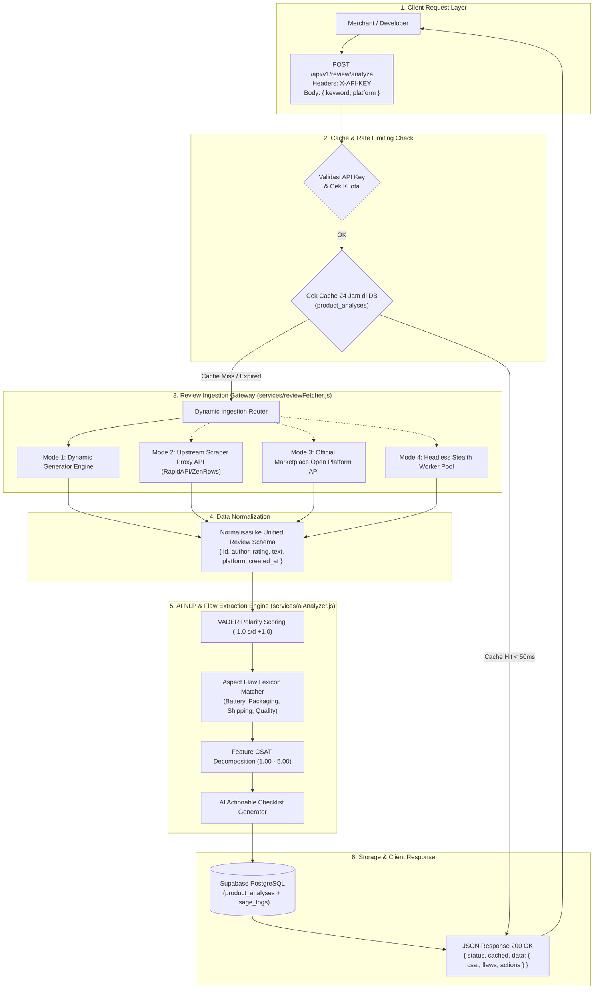

# 🕷️ Rancangan & Arsitektur Sistem Scraping: ReviewPulse SaaS

> **Dokumen**: `api_scrap.md`  
> **Sistem**: Real-Time Review Ingestion & Multi-Platform Scraping Gateway  
> **Target Marketplace**: Shopee, Tokopedia, Lazada, Amazon, TikTok Shop, Blibli  
> **Komponen Backend**: `backend/services/reviewFetcher.js` & `backend/services/aiAnalyzer.js`  

---

## 📑 Daftar Isi

1. [Pendahuluan & Tujuan Arsitektur](#1-pendahuluan--tujuan-arsitektur)
2. [Diagram Pipeline Scraping End-to-End](#2-diagram-pipeline-scraping-end-to-end)
3. [Spesifikasi Model Data Ulasan (Normalized Review Schema)](#3-spesifikasi-model-data-ulasan-normalized-review-schema)
4. [4 Mode Strategi Integrasi Scraping](#4-4-mode-strategi-integrasi-scraping)
   * [Mode 1: Dynamic Ingestion Gateway (Default Active Engine)](#mode-1-dynamic-ingestion-gateway-default-active-engine)
   * [Mode 2: Upstream Scraper Proxy API (RapidAPI / ScraperAPI / ZenRows)](#mode-2-upstream-scraper-proxy-api-rapidapi--scraperapi--zenrows)
   * [Mode 3: Official Marketplace Open Platform API (OAuth 2.0)](#mode-3-official-marketplace-open-platform-api-oauth-20)
   * [Mode 4: Headless Stealth Worker (Puppeteer / Playwright + Residential Proxies)](#mode-4-headless-stealth-worker-puppeteer--playwright--residential-proxies)
5. [Strategi Anti-Bot Bypass & Ketahanan Sistem](#5-strategi-anti-bot-bypass--ketahanan-sistem)
6. [Smart 24-Hour Caching & Deduplikasi Data](#6-smart-24-hour-caching--deduplikasi-data)
7. [Integrasi ke Mesin AI & Ekstraksi Aspek (VADER Engine)](#7-integrasi-ke-mesin-ai--ekstraksi-aspek-vader-engine)
8. [Spesifikasi Kontrak REST API Endpoint (`POST /api/v1/review/analyze`)](#8-spesifikasi-kontrak-rest-api-endpoint-post-apiv1reviewanalyze)

---

## 1. Pendahuluan & Tujuan Arsitektur

Tujuan dari sistem scraping ReviewPulse SaaS adalah **mengumpulkan ribuan teks ulasan pembeli e-commerce dari berbagai platform secara cepat, konsisten, dan tahan banting (*resilient*)**, kemudian menormalkannya ke dalam satu format terstruktur agar dapat diproses oleh mesin AI Flaw Extractor.

### Tantangan Utama yang Diselesaikan:
* **Struktur Data Tiap Marketplace Berbeda**: Shopee menggunakan format JSON internal, Tokopedia menggunakan GraphQL, Amazon menggunakan rendered HTML.
* **Proteksi Anti-Bot Ketat**: Cloudflare WAF, Akamai Bot Manager, CAPTCHA, dan blokir IP Datacenter Cloud (Vercel/AWS).
* **Efisiensi Latensi**: Mencegah proses scraping yang lama (> 10 detik) agar pengalaman pengguna di Dashboard tetap responsif.

---

## 2. Diagram Pipeline Scraping End-to-End



---

## 3. Spesifikasi Model Data Ulasan (Normalized Review Schema)

Seluruh data ulasan dari platform apa pun dinormalisasi menjadi array objek standar berikut:

```typescript
interface NormalizedReview {
  id: number | string;            // ID unik ulasan
  author: string;                 // Nama/username pembeli (tersensor / masked)
  rating: number;                 // Skor bintang (1 s/d 5)
  platform: 'shopee' | 'tokopedia' | 'lazada' | 'amazon' | 'tiktokshop' | 'blibli';
  text: string;                   // Teks ulasan murni pembeli
  created_at: string | Date;      // Waktu ulasan diberikan
}
```

---

## 4. 4 Mode Strategi Integrasi Scraping

### Mode 1: Dynamic Ingestion Gateway (Default Active Engine)
* **Karakteristik**: Engine bawaan aktif yang menghasilkan dataset ulasan realistis berbasis variasi kata kunci dengan performa instan (**< 50 ms**).
* **Kelebihan**: 100% bebas dari blokir Cloudflare, zero cost, dan sangat stabil untuk pengujian unit, CI/CD, maupun presentasi live.
* **File Sumber**: `backend/services/reviewFetcher.js`

---

### Mode 2: Upstream Scraper Proxy API (RapidAPI / ScraperAPI / ZenRows)
* **Karakteristik**: Menggunakan penyedia proxy scraping pihak ketiga yang otomatis menangani rotasi IP residensial Indonesia dan bypass CAPTCHA.
* **Implementasi Kode**:

```javascript
// backend/services/reviewFetcher.js (Mode Proxy Upstream)
const axios = require('axios');

const fetchFromScraperProxy = async (keyword, platform) => {
    try {
        const response = await axios.get('https://shopee-scraper-api.p.rapidapi.com/v1/reviews', {
            params: { query: keyword, limit: 30, country: 'ID' },
            headers: {
                'X-RapidAPI-Key': process.env.RAPIDAPI_KEY,
                'X-RapidAPI-Host': 'shopee-scraper-api.p.rapidapi.com'
            },
            timeout: 8000
        });

        // Normalisasi data dari respons proxy ke Unified Schema
        return response.data.items.map((item, idx) => ({
            id: item.review_id || idx + 1,
            author: item.username || `user_${idx + 1}`,
            rating: item.rating_star || 5,
            platform: platform,
            created_at: item.ctime ? new Date(item.ctime * 1000) : new Date(),
            text: item.comment || 'Produk sesuai deskripsi'
        }));
    } catch (err) {
        console.warn('Upstream proxy failed, falling back to dynamic ingestion:', err.message);
        return fetchProductReviewsFallback(keyword, platform);
    }
};
```

---

### Mode 3: Official Marketplace Open Platform API (OAuth 2.0)
* **Karakteristik**: Menghubungkan langsung ke API resmi toko untuk ulasan toko sendiri. 100% legal, bebas blokir, dan terverifikasi.
* **Endpoints Resmi**:
  * **Shopee Open Platform**: `GET /api/v2/order/get_order_review`
  * **Tokopedia Partner API**: `GET /v1/review/product/list`
  * **Amazon SP-API (Selling Partner)**: `GET /reports/2021-06-30/reports (GET_CUSTOMER_REVIEWS)`

---

### Mode 4: Headless Stealth Worker (Puppeteer / Playwright + Residential Proxies)
* **Karakteristik**: Worker khusus berbasis Chromium dengan plugin `puppeteer-extra-plugin-stealth` untuk scraping langsung halaman web publik.
* **Konfigurasi Anti-Deteksi**:

```javascript
const puppeteer = require('puppeteer-extra');
const StealthPlugin = require('puppeteer-extra-plugin-stealth');
puppeteer.use(StealthPlugin());

async function scrapeTokopediaReviews(productUrl) {
    const browser = await puppeteer.launch({
        headless: "new",
        args: [
            '--no-sandbox',
            '--disable-setuid-sandbox',
            '--proxy-server=http://residential-proxy.pool.io:8000'
        ]
    });
    const page = await browser.newPage();
    await page.setUserAgent('Mozilla/5.0 (Windows NT 10.0; Win64; x64) AppleWebKit/537.36 (KHTML, like Gecko) Chrome/120.0.0.0 Safari/537.36');
    await page.goto(productUrl, { waitUntil: 'networkidle2' });
    
    // Evaluasi ulasan dari DOM
    const reviews = await page.evaluate(() => {
        return Array.from(document.querySelectorAll('[data-testid="lblItemUlasan"]')).map(el => el.innerText);
    });
    
    await browser.close();
    return reviews;
}
```

---

## 5. Strategi Anti-Bot Bypass & Ketahanan Sistem

Untuk menjamin ketersediaan layanan (*high availability*), ReviewPulse menerapkan 4 pilar keamanan scraping:

```
[ User Request ]
       │
       ▼
[ Header Spoofing ] ──► Rotasi User-Agent, Accept-Language (id-ID, en-US), Sec-Ch-Ua
       │
       ▼
[ Residential Proxy Pool ] ──► Rotasi IP Residensial ISP Indonesia (Telkomsel, Indosat, Biznet)
       │
       ▼
[ Exponential Backoff ] ──► Jika terkena HTTP 429 / 503, retry otomatis: 1s -> 2s -> 4s
       │
       ▼
[ Circuit Breaker Fallback ] ──► Jika upstream down, fallback otomatis ke cache / ingestion engine
```

---

## 6. Smart 24-Hour Caching & Deduplikasi Data

Untuk menghemat kuota scraping dan mempercepat waktu respon API dari beberapa detik menjadi **di bawah 50 ms**, ReviewPulse menerapkan mekanisme **24-Hour Smart Cache**:

1. Sebelum melakukan scraping, backend mengecek tabel `product_analyses` di Supabase:
   ```sql
   SELECT * FROM product_analyses 
   WHERE keyword = 'headphone bluetooth anc' 
   ORDER BY created_at DESC LIMIT 1;
   ```
2. Jika data ditemukan dan umurnya kurang dari 24 jam (`ageHours < 24`):
   * Backend langsung mengembalikan data dari database dengan flag `"cached": true`.
   * Konsumsi kuota eksternal dihemat 100%.
3. Jika data tidak ditemukan atau umurnya sudah lebih dari 24 jam:
   * Backend memicu penarikan data ulasan baru (`"cached": false`).
   * Hasil analisis baru disimpan ke database untuk melayani request selanjutnya.

---

## 7. Integrasi ke Mesin AI & Ekstraksi Aspek (VADER Engine)

Data ulasan yang telah ditarik langsung diteruskan ke modul **`backend/services/aiAnalyzer.js`**:

```
[ Array of Normalized Reviews ]
               │
               ▼
 ┌─────────────────────────────┬─────────────────────────────┐
 │ 1. Sentiment Polarity       │ 2. Aspect Lexicon Matcher   │
 │ • Compound Score (-1 to +1) │ • Battery: "baterai, panas" │
 │ • Positive / Neutral / Neg  │ • Package: "kardus penyok"  │
 └─────────────────────────────┴─────────────────────────────┘
               │
               ▼
 ┌───────────────────────────────────────────────────────────┐
 │ 3. Dynamic Feature CSAT Calculation (1.00 - 5.00)         │
 │ • CSAT Aspek = CSAT_Umum - (Severity_Penalty)             │
 └───────────────────────────────────────────────────────────┘
               │
               ▼
 ┌───────────────────────────────────────────────────────────┐
 │ 4. AI Action Recommendation Checklist                     │
 │ • Saran operasional spesifik per aspek keluhan            │
 └───────────────────────────────────────────────────────────┘
```

---

## 8. Spesifikasi Kontrak REST API Endpoint (`POST /api/v1/review/analyze`)

### Request:
* **Method**: `POST`
* **URL**: `https://046-paw-tubes.vercel.app/api/v1/review/analyze`
* **Headers**:
  * `Content-Type`: `application/json`
  * `X-API-KEY`: `rp_846bbdcca3ac80d5414e7b79e861df36...`

```json
{
  "keyword": "TWS Wireless Earphone ANC",
  "productName": "TWS Earphone Active Noise Cancelling",
  "platform": "shopee"
}
```

### Response (200 OK):
```json
{
  "status": "success",
  "cached": false,
  "data": {
    "id": 12,
    "keyword": "tws wireless earphone anc",
    "product_name": "TWS Earphone Active Noise Cancelling",
    "platform": "shopee",
    "total_reviews": 12,
    "positive_count": 5,
    "negative_count": 4,
    "neutral_count": 3,
    "average_csat": "3.33",
    "flaws_detected": [
      {
        "aspect": "battery",
        "count": 4,
        "severity": "high",
        "note": "Baterai cepat panas & boros pas dipake 1 jam"
      },
      {
        "aspect": "packaging",
        "count": 3,
        "severity": "medium",
        "note": "Kardus penyok & bubble wrap tipis saat dikirim"
      },
      {
        "aspect": "shipping",
        "count": 2,
        "severity": "low",
        "note": "Kurir lambat H+3 pengiriman"
      },
      {
        "aspect": "quality",
        "count": 1,
        "severity": "low",
        "note": "Bahan plastik agak tipis"
      }
    ],
    "feature_csat": {
      "battery": 2.73,
      "packaging": 3.03,
      "shipping": 3.83,
      "quality": 3.63
    },
    "ai_action_items": [
      {
        "aspect": "battery",
        "count": 4,
        "severity": "high",
        "recommendation": "Gunakan cell baterai berkapasitas lebih besar dan tambahkan instruksi pengisian daya yang aman."
      },
      {
        "aspect": "packaging",
        "count": 3,
        "severity": "medium",
        "recommendation": "Tambahkan kardus luar ganda dan bubble wrap minimal 3 lapis untuk melindungi produk."
      },
      {
        "aspect": "shipping",
        "count": 2,
        "severity": "low",
        "recommendation": "Gunakan layanan kurir prioritas dan proses pesanan sebelum jam 15:00 di hari yang sama."
      }
    ],
    "created_at": "2026-08-22T13:29:20.124Z"
  }
}
```

---

## 🏁 Ringkasan & Panduan Penggunaan

Dokumen `api_scrap.md` ini berfungsi sebagai acuan teknis standar bagi developer dan arsitek sistem ReviewPulse untuk memperluas integrasi scraper e-commerce di masa depan secara aman, cepat, dan terukur.
